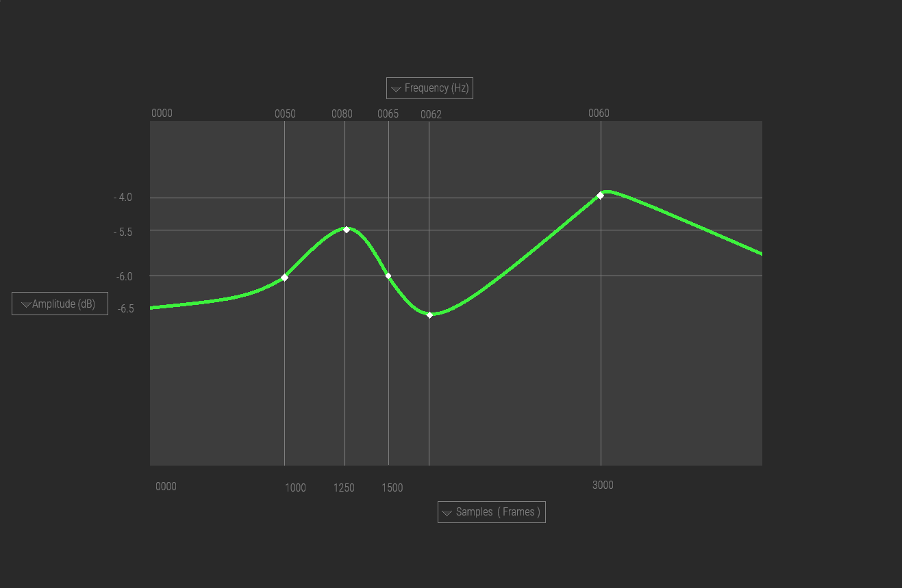
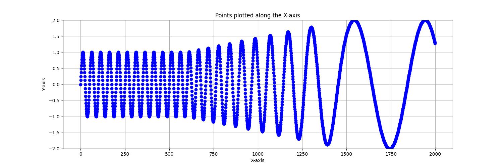

# Artificial Speech Formant Editor (Beta)

## Purpose

The Artificial Speech Formant Editor is designed to facilitate the creation, manipulation, and visualization of speech formants. Speech formants are the resonant frequencies of the human vocal tract, and they are critical to the identification and articulation of vowel sounds in speech processing. This project aims to provide a user-friendly web interface where users can interactively adjust formant frequencies and amplitudes to synthesize and study artificial speech sounds.

The editor includes an interactive viewer with color-coded combo/select dropdown boxes positioned on all four extents of the graph. This allows for precise control over the speech formant parameters and real-time visual feedback on how these parameters affect the speech synthesis.

## Project Structure

The project consists of the following files, each serving a distinct purpose within the application:

### `SpeechFormantEditor.html`

- **Purpose**: Serves as the entry point of the application. Contains the markup for the interactive viewer and dropdown elements.
- **Contents**: HTML elements for the graph container, formant control dropdowns, and references to external CSS and JavaScript files.

### `_.css`

- **Purpose**: Provides styling for the application, ensuring that the interface is visually aligned with the specifications.
- **Contents**: CSS rules for positioning the dropdown boxes, styling the graph container, and color-coding the control elements.

### `_.js`

- **Purpose**: Contains the interactive logic of the application. Handles user interactions and updates the graph in real time.
- **Contents**: JavaScript code for initializing the graph using a charting library, attaching event listeners to dropdowns, and updating formant data dynamically.

### `chart.js`

- **Purpose**: An external charting library file, such as Chart.js or D3.js, which is used to render the interactive graph.
- **Contents**: The library's source code that provides the functionality for drawing and animating the formant graph.

### `README.md`

- **Purpose**: Offers a detailed explanation of the project, how to set it up, and how to use the editor.
- **Contents**: Markdown text with setup instructions, usage guidelines, and information about the technology stack used in the project.

### `LICENSE` (Inherited)

- **Purpose**: Describes the legal conditions under which the software is released.
- **Contents**: The full text of the software license (e.g., MIT, GPL, Apache).

## How to Use

To use the Artificial Speech Formant Editor:

1. Open `SpeechFormantEditor.html` in a web browser.
2. Use the dropdown boxes to select the desired formant frequencies and amplitudes.
3. Observe the changes in the graph as you adjust the formants.
4. Utilize the visual feedback to understand the relationship between formants and speech sounds.

## Compatibility
- **Desktop**: Firefox 121.0+ (64-bit), Chrome 93.0.4577.82+(64-bit), Edge 93.0.961.52+(64-bit)

## Contribution

Contributors are welcome to enhance the features of the Artificial Speech Formant Editor. Please read `CONTRIBUTING.md` for guidelines on how to propose changes.

## License

This project is licensed under the governing license specified in the `LICENSE` file.